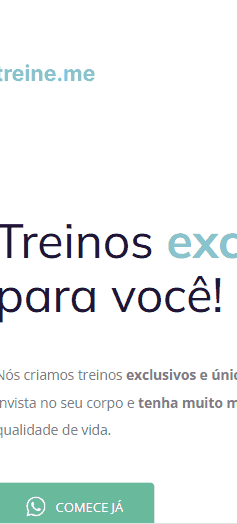
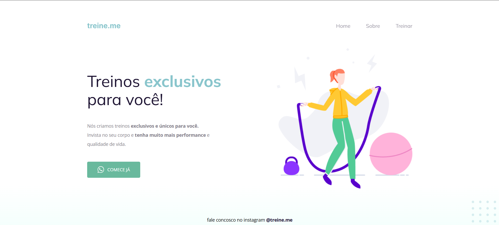

# Projeto 02


# Sobre o projeto

Link para utilizar o projeto: Em breve

Este é o segundo projeto desenvolvido durante as aulas na trilha Explorer, referente ao curso em programação web para iniciantes da escola [®Rocketseat](https://www.rocketseat.com.br/).


O objetivo deste pequeno projeto é representar uma possível página inicial de uma empresa de academia utilizando as principais tags HTML e seletores do CSS, vistos no [primeiro projeto](https://github.com/gmartinssilva/projeto_01), além de aplicar novos conceitos, como propriedades flex e gradientes do CSS.

Para utilizar o projeto
não é necessário realizar a instalação de nenhuma biblioteca adicional, basta um navegador.

## Layout mobile


## Layout web


# Tecnologias utilizadas
- HTML
- CSS

# Como executar o projeto
```bash
# clonar repositório
git clone https://github.com/gmartinssilva/projeto_02

# Entrar na pasta do projeto e abrir o arquivo index.html no seu navegador
```

# Autor

Gabriel Martins Silva

https://www.linkedin.com/in/gabrielmartinssilva/

# Referências

[Badges](https://github.com/Ileriayo/markdown-badges)
